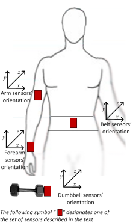
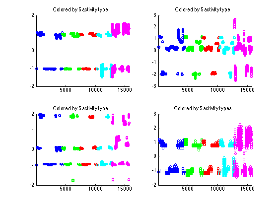
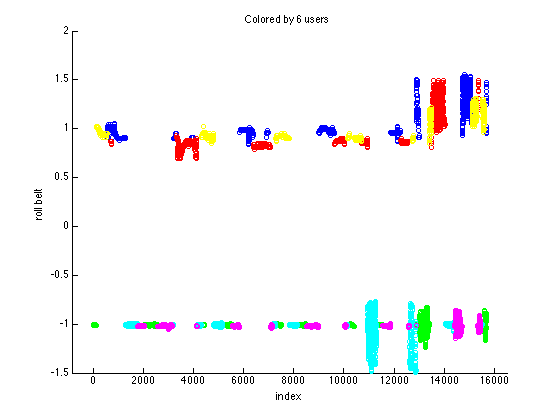
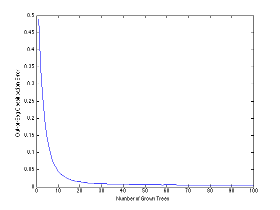
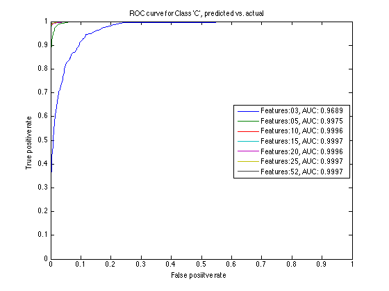

Analyzing Fitness Data from Wearable Devices in MATLAB
======================================================

Collecting and tracking health and fitness data with smartphones and wearable devices is about to go mainstream as the internet giants like Apple, Google and Samsung jumping into the fray. But if you collect data, what's the point if you don't analyze it!

I would like to use a publicly available dataset about weight lifting and pretend that we are going to build a mobile app to advise end users whether they are performing the exercise correctly, and if not, which common mistakes they are making. We will use machine learning/predictive modeling technique called 'Random Forest' popularized by Kaggle competitions to detect user activity patterns.

Dataset to analyze
------------------

[Human Activity Recognition (HAR)](http://groupware.les.inf.puc-rio.br/har) Weight Lifting Exercise Dataset provides measurements to determine "how well an activity was performed". 6  subjects performed 1 set of 10 Unilateral Dumbbell Biceps Curl in 5 different ways.

1. exactly according to the specification (Class A)
2. throwing the elbows to the front (Class B)
3. lifting the dumbbell only halfway (Class C)
4. lowering the dumbbell only halfway (Class D)
5. throwing the hips to the front (Class E)

All together 39,242 samples with 159 variables are available in the original dataset, but we will use a reduced subset of 19,622 samples.

Sensors were placed on the subjects' belts, armbands, glove and dumbbells, as described below:



<cite>Citation Velloso, E.; Bulling, A.; Gellersen, H.; Ugulino, W.; Fuks, H. Qualitative Activity Recognition of Weight Lifting Exercises. Proceedings of 4th International Conference in Cooperation with SIGCHI (Augmented Human '13) . Stuttgart, Germany: ACM SIGCHI, 2013. Read more: [http://groupware.les.inf.puc-rio.br/har#ixzz34dpS6oks](http://groupware.les.inf.puc-rio.br/har#ixzz34dpS6ok)</cite>

```
% load the dataset
% T = readtable('WearableComputing_weight_lifting_exercises_biceps_curl_variations.csv','TreatAsEmpty','NA');
T = readtable('subset.csv','TreatAsEmpty','NA'); % use a subset instead

% separate the classification label from the predictor variables
class = categorical(T.classe); T.classe = [];
fprintf('Num samples in data   : %d\n',height(T))
fprintf('Num predictors in data: %d\n\n',width(T))
```

Partition the dataset for cross validation
------------------------------------------

One of the key techniques you use in predictive modeling or machine learning is [cross validation](http://en.wikipedia.org/wiki/Cross-validation_%28statistics%29). Roughly speaking, you hold out part of available data for testing later, and build models using the remaining dataset. The held out set is called 'test set' and the set we will use for modeling is called 'training set'. This makes it more difficult to [overfit](http://en.wikipedia.org/wiki/Overfitting) your model, because you can test your model against the data you didn't use in the modeling process.

```
% Set the random number seed to make the results repeatable
rng('default');

% Partition the dataset to a 80:20 split
cv = cvpartition(height(T),'holdout',0.20);

% Training set
Xtrain = T(training(cv),:);
Ytrain = class(training(cv));
fprintf('\nTraining Set\n')
tabulate(Ytrain)

% Test set
Xtest = T(test(cv),:);
Ytest = class(test(cv));
fprintf('\nTest Set\n')
tabulate(Ytest)
```
```
Training Set
  Value    Count   Percent
      A     4446     28.32%
      B     3064     19.52%
      C     2771     17.65%
      D     2557     16.29%
      E     2860     18.22%

Test Set
  Value    Count   Percent
      A     1134     28.90%
      B      733     18.68%
      C      651     16.59%
      D      659     16.79%
      E      747     19.04%
```

Clean and normalize the dataset
-------------------------------

Raw data is never clean, so you need to check for missing values and transform data into usable form. If the range of values differ substantially from one variable to another, it can affect the machine learning algorithms. Therefore we normalize the data as well.

```
%  check for missing values
missingVals = sum(ismissing(Xtrain));
fprintf('\nNum vars with missing vals: %d\n',sum(missingVals > 0))
fprintf('Max num missing vals      : %d/%d\n',max(missingVals),height(Xtrain))
fprintf('Avg num missing vals      : %d/%d\n\n',mean(missingVals(missingVals > 0)),height(Xtrain))

% too many values missing for those variables to be useful
% dropping vars with missing values 
Xtrain = Xtrain(:,missingVals == 0); Xtest = Xtest(:,missingVals == 0);

% separate users
users = double(categorical(Xtrain.user_name));

% remove user name, time stamps, etc.
Xtrain(:,1:6) =[]; Xtest(:,1:6) =[];

% apply normalization to each variable in training set
arr = table2array(Xtrain); mu = mean(arr); sigma = std(arr);
shiftMean2zero = bsxfun(@minus,arr,mu); 
scalebySigma = bsxfun(@rdivide,shiftMean2zero,sigma);
Xtrain = array2table(scalebySigma,'VariableNames',Xtrain.Properties.VariableNames);

% apply normalzation to each variable in test set 
% with mu and sigma from training set (because test set mu and sigma will
% not be available in actual predictive use of the model).
arr = table2array(Xtest);
shiftMean2zero = bsxfun(@minus,arr,mu); 
scalebySigma = bsxfun(@rdivide,shiftMean2zero,sigma);
Xtest = array2table(scalebySigma,'VariableNames',Xtest.Properties.VariableNames);
disp('Vars with missing vals and others removed.')
```
```
Num vars with missing vals: 100
Max num missing vals      : 15365/15698
Avg num missing vals      : 15365/15698

Vars with missing vals and others removed.
```

Exploratory Data Analysis
-------------------------

You begin exploratory data analysis by plotting the variables in order to get oriented with the dataset. Plots of the first four variables show that:

1. data is sorted by class - requires random reshuffling.
2. data points cluster around a few different mean values - indicating that measurements were taken by devices calibrated in a few different ways. The following plot shows the first variable by users, and it is clear that one group used one calibration and another group used a different one.
3. those variables exhibit a distinct patterns for Class E (colored in magenta) - those variables will be useful to isolate it.

```
figure
subplot(2,2,1)
gscatter(1:height(Xtrain),Xtrain.roll_belt,Ytrain,'bgrcm','o',5,'off')
xlim([1 height(Xtrain)]);title('Colored by 5 activity type')
subplot(2,2,2)
gscatter(1:height(Xtrain),Xtrain.pitch_belt,Ytrain,'bgrcm','o',5,'off')
xlim([1 height(Xtrain)]);title('Colored by 5 activity type')
subplot(2,2,3)
gscatter(1:height(Xtrain),Xtrain.yaw_belt,Ytrain,'bgrcm','o',5,'off')
xlim([1 height(Xtrain)]);title('Colored by 5 activity type')
subplot(2,2,4)
gscatter(1:height(Xtrain),Xtrain.total_accel_belt,Ytrain,'bgrcm','o',5,'off')
xlim([1 height(Xtrain)]);title('Colored by 5 activity types')

% plot the first variable by user
figure
gscatter(1:height(Xtrain),Xtrain.roll_belt,users,'bgrcmy','o',5,'off')
ylabel('roll belt'); xlabel('index'); title('Colored by 6 users')
```



Predictive Modeling with Random Forest
--------------------------------------

The dataset has a bit of issues with calibration. We could further preprocess the data in order to remove calibration gaps. This time, however, I would like to use the dataset as is and use a highly flexible algorithm called [Random Forest](http://en.wikipedia.org/wiki/Random_forest). In MATLAB, this algorithm is implemented in [TreeBagger](http://www.mathworks.com/help/stats/treebagger.html) class available in [Statistics Toolbox](http://www.mathworks.com/products/statistics/).

Random Forest became popular particularly after it was used by number of winners in [Kaggle competitions](http://www.kaggle.com/). It uses a large ensemble of decision trees (thus 'forest') trained on random subsets of data and uses majority votes of those trees to predict the result. It tends to produce a highly accurate result, but the complexity of the algorithm makes it slow and difficult to interpret.

To accelerate the computation, I will enable parallel option supported on [Parallel Computing Toolbox](http://www.mathworks.com/products/parallel-computing/). You can comment out unnecessary code if you don't use it.

Once the model is built, you will see the [confusion matrix](http://www.mathworks.com/help/stats/confusionmat.html) that compares the actual class labels to predicted class labels. If everything lines up on a diagonal line, then you got 100% accuracy. Off-diagonal numbers are misclassification errors.

The model has a very high prediction accuracy even though we saw earlier that our dataset was not as problem free as we would like.

```
% initialize parallel option - comment out if you don't use parallel
poolobj = gcp('nocreate'); % don't create a new pool even if no pool exits
if isempty(poolobj)
    parpool('local',2)
end
opts = statset('UseParallel',true);

% reshuffle the dataset
randidx = randperm(height(Xtrain));
Xtrain = Xtrain(randidx,:);
Ytrain = Ytrain(randidx);

% create a random forest model with 100 trees, parallel enabled...
rfmodel = TreeBagger(100,table2array(Xtrain),Ytrain,'options',opts,...
    'Method','classification','oobvarimp','on');
% non-parallel version of the same model
% rfmodel = TreeBagger(100,table2array(Xtrain),Ytrain,...
%     'Method','classification','oobpre','on','oobvarimp','on');

% predict the class labels for test set
[Ypred,Yscore]= predict(rfmodel,table2array(Xtest));

% compute the confusion matrix and prediction accuracy
C = confusionmat(Ytest,categorical(Ypred));
disp(array2table(C,'VariableNames',rfmodel.ClassNames,'RowNames',rfmodel.ClassNames))
fprintf('Prediction accuracy on test set: %f\n\n', sum(C(logical(eye(5))))/sum(sum(C)))
```
```
Starting parallel pool (parpool) using the 'local' profile ... connected to 2 workers.

ans = 

 Pool with properties: 

            Connected: true
           NumWorkers: 2
              Cluster: local
        AttachedFiles: {}
          IdleTimeout: 30 minute(s) (30 minutes remaining)
          SpmdEnabled: true

          A       B      C      D      E 
         ____    ___    ___    ___    ___

    A    1133      0      0      0      1
    B       3    730      0      0      0
    C       0      6    643      2      0
    D       0      0     10    649      0
    E       0      0      0      5    742

Prediction accuracy on test set: 0.993119
```
Plot misclassification errors by number of trees
------------------------------------------------

I happened to pick 100 trees in the model, but you can check the misclassification errors relative to the number of trees used in prediction. The plot shows that 100 is an overkill - we could use fewer trees and that will make it go faster.

```
figure
plot(oobError(rfmodel));
xlabel('Number of Grown Trees');
ylabel('Out-of-Bag Classification Error');
```


Variable Importance
-------------------

One major criticism of Random Forest is that it is a black box algorithm and not easy to understand what it is doing. However, Random Forest can provide variable importance measure, which corresponds to the change in prediction error with and without the presence of a given variable in the model.

For our hypothetical weight lifting trainer mobile app, Random Forest would be too cumbersome and slow to implement, so you want to use a simpler prediction model with fewer predictor variables. Random Forest can help you with selecting which predictors you can drop without sacrificing the prediction accuracy too much.

Let's see how you can do this with TreeBagger.

```
% get the variable importance scores and sort it. 
vars = Xtrain.Properties.VariableNames;
% because we turned 'oobvarimp' to 'on', the model contains 
% OOBPermutedVarDeltaError that acts as variable importance measure
varimp = rfmodel.OOBPermutedVarDeltaError';
[~,idxvarimp]= sort(varimp);
labels = vars(idxvarimp);

% plot the sorted scores
figure
barh(varimp(idxvarimp),1); ylim([1 52]);
set(gca, 'YTickLabel',labels, 'YTick',1:numel(labels))
title('Variable Importance'); xlabel('score')
```


Evaluate trade-off with ROC plot
--------------------------------

Now let's do the trade-off between the number of predictor variables and prediction accuracy. [Receiver operating characteristic (ROC)](http://en.wikipedia.org/wiki/Receiver_operating_characteristic) plot provides a convenient way to visualize and compare performance of binary classifiers. You plot false positive rate against true positive rate at various prediction threshold to produce the curves. If you get completely random result, the curve should follow a diagonal line. If you get a 100% accuracy, then the curve should hug the upper left corner. This means you can use the area under curve (AUC) to evaluate how well each model performs.

Let's plot ROC curves with different set of predictor variables, using "C" class as the positive class, since we can only do this one class at a time, and the previous confusion matrix shows more misclassification errors for this class than others. You can use [perfcurve](http://www.mathworks.com/help/stats/perfcurve.html) to compute ROC curves.

```
% sort variable importance scores in a descending order
[~,idxvarimp]= sort(varimp,'descend');

% specify the positive class to use
posClass = 'C';
posIdx = find(strcmp(posLabel,categories(Ytrain)));

% initialize some accumulators
colors = lines(7);
curves = zeros(1,7);
labels = cell(7,1);

% plot the ROC curves
figure
% start with the full feature set from the previous computation
[rocX,rocY,~,auc] = perfcurve(Ytest,Yscore(:,posIdx),posClass);
curves(7) = plot(rocX,rocY,'Color',colors(end,:));
labels{7} = sprintf('Features:%d, AUC: %.4f',width(Xtrain),auc); 
hold on
% test with various number of features
featSize = [3,5,10,15,20,25];
for i = 1:length(featSize)
    % use 50 trees and fewer options to make it go faster
    model = TreeBagger(50,table2array(Xtrain(:,sort(idxvarimp(1:featSize(i))))),...
        Ytrain,'Method','classification','options',opts);
    % non parallel version
%     model = TreeBagger(50,table2array(Xtrain(:,sort(idxvarimp(1:featSize(i))))),...
%         Ytrain,'Method','classification');
    % get the classification scores
    [~,Yscore] = predict(model,table2array(Xtest(:,sort(idxvarimp(1:featSize(i))))));
    % compute and plot the ROC curve and AUC score
    [rocX,rocY,~,auc] = perfcurve(Ytest,Yscore(:,posIdx),posClass);
    curves(i) = plot(rocX,rocY,'Color',colors(i,:));
    % get the labels for legend
    labels{i} = sprintf('Features:%02d, AUC: %.4f',featSize(i),auc); 
end
hold off
xlabel('False posiitve rate');
ylabel('True positive rate')
title(sprintf('ROC curve for Class ''%s'', predicted vs. actual',posClass))
legend(curves,labels,'Location','East');
```


The reduced model with 12 features
----------------------------------

Based on the previous analysis, it looks like you can achieve high accuracy rate even if you use as few as 10 features. Let's say we settled for 12 features. We now know you don't have to use the data from the glove for prediction, so that's one less sensor our hypothetical end users would have to buy. Given this result, I may even consider dropping the arm band, and just stick with the belt and dumbbell sensors.

```
% model with 12 features
top12 = TreeBagger(50,table2array(Xtrain(:,sort(idxvarimp(1:12)))),...
        Ytrain,'Method','classification','options',opts);
% non-parallel version    
% top12 = TreeBagger(50,table2array(Xtrain(:,sort(idxvarimp(1:12)))),...
%         Ytrain,'Method','classification');

% compute the confusion matrix and prediction accuracy
Ypred = predict(top12,table2array(Xtest(:,sort(idxvarimp(1:12)))));
C = confusionmat(Ytest,categorical(Ypred));
disp(array2table(C,'VariableNames',rfmodel.ClassNames,'RowNames',rfmodel.ClassNames))
fprintf('Prediction accuracy on the test set: %f\n\n', sum(C(logical(eye(5))))/sum(sum(C)))

% show which features were included
disp(table(varimp(idxvarimp(1:12)),'RowNames',vars(idxvarimp(1:12)),...
    'VariableNames',{'Importance'}));

% shut down the parallel pool 
delete(poolobj);
```
```
          A       B      C      D      E 
         ____    ___    ___    ___    ___

    A    1133      0      0      0      1
    B       5    720      7      1      0
    C       0      8    640      3      0
    D       2      0      6    651      0
    E       0      0      0      1    746

Prediction accuracy on the test set: 0.991335

                         Importance
                         __________

    roll_belt            2.7887    
    yaw_belt             2.6094    
    pitch_belt           2.3812    
    gyros_arm_y          2.2761    
    magnet_dumbbell_z    2.2583    
    magnet_dumbbell_y    1.9959    
    pitch_forearm         1.941    
    gyros_forearm_y      1.7463    
    magnet_arm_z         1.7445    
    gyros_dumbbell_x     1.6996    
    accel_dumbbell_y     1.6906    
    gyros_dumbbell_z     1.6339    
```

Conclusion and the next steps - integrate your code into your app
----------------------------------------------------------------

Despite my initial misgivings about the data, we were able to maintain high prediction accuracy with Random Forest model with just 12 features. However, Random Forest is probably not an ideal model to implement on a mobile app given its memory foot print and slow response time.

The next step is to find a simpler models, such as [logistics regression](http://www.mathworks.com/help/stats/mnrfit.html), that can perform decently. You may need to do more preprocessing of the data to make it work.

Finally, I have never tried this before, but you could generate C code out of MATLAB to incorporate it into an iPhone app. Watch this webinar [MATLAB to iPhone Made Easy](http://www.mathworks.com/videos/matlab-to-iphone-made-easy-90834.html) for more details. I believe there will be an Android version of this webinar eventually.


